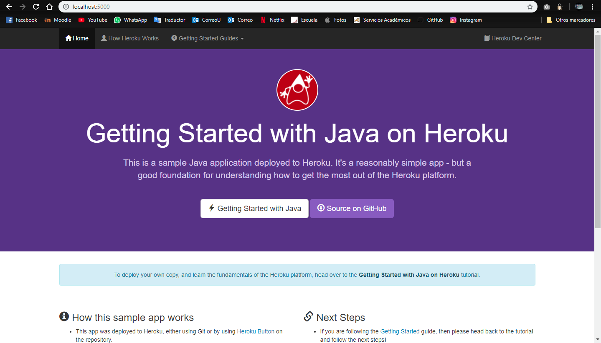
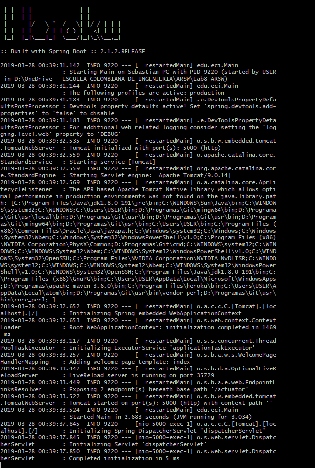
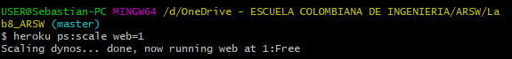
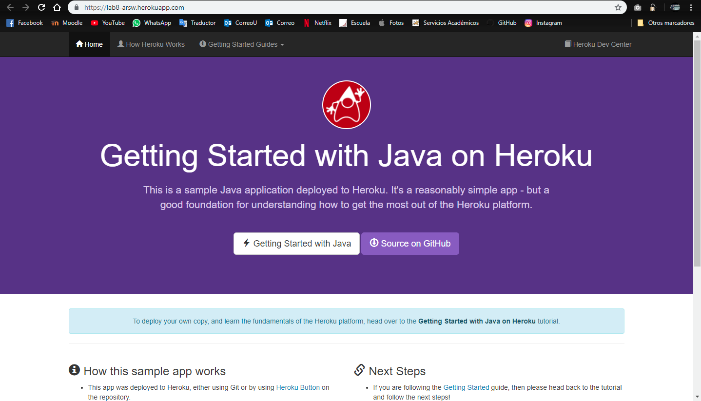
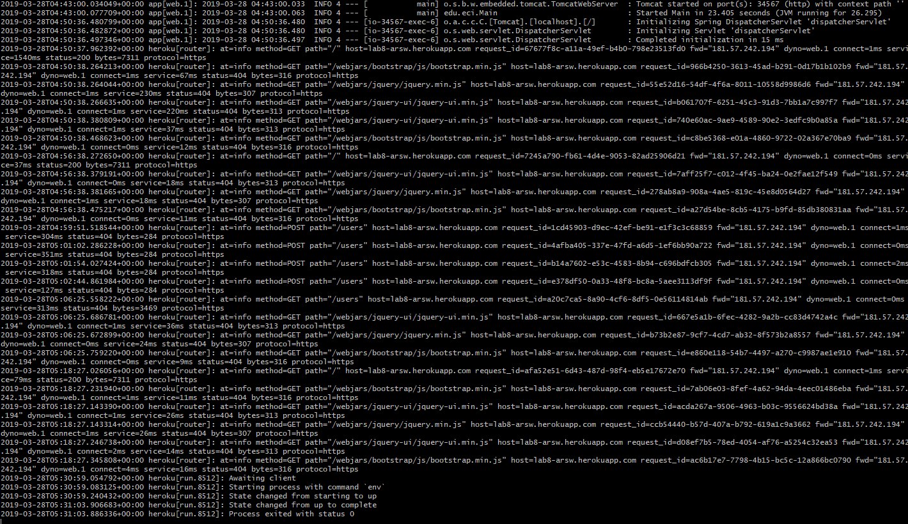
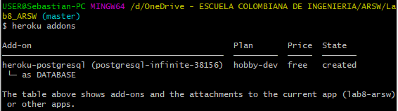
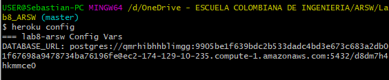

# java-getting-started

A barebones Java app, which can easily be deployed to Heroku.

This application supports the [Getting Started with Java on Heroku](https://devcenter.heroku.com/articles/getting-started-with-java) article - check it out.

[](https://heroku.com/deploy)

## Running Locally

Make sure you have Java and Maven installed.  Also, install the [Heroku CLI](https://cli.heroku.com/).

```sh
$ git clone https://github.com/heroku/java-getting-started.git
$ cd java-getting-started
$ mvn install
$ heroku local:start
```

Your app should now be running on [localhost:5000](http://localhost:5000/).

## Deploying to Heroku

```sh
$ heroku create
$ git push heroku master
$ heroku open
```

## Postman Testing

Use the following postman collection to test the REST API.

[Postman Collection](https://www.getpostman.com/collections/316dc4d4e748fe9810e9) 

## Documentation

For more information about using Java on Heroku, see these Dev Center articles:

- [Java on Heroku](https://devcenter.heroku.com/categories/java)


# Lab 8
## Executing the app

- 
- 
### Questions
- The application run a Heroku website.
- The application uses GET, POST, PUT and DELETE http methods to interact with the API's user. The services offered allow us to interact with users and cars in housed in the database.
- The procfile if the file that heroku deploy uses to run the application that is in .jar file.
## Deploy the app
After create the app with the command `heroku create` and save changes in the heroku remote with `git push heroku master`:

-  `heroku ps:scale web=1`

- `heroku open`


## View logs



## Use a database

- `heroku addons`  

- `heroku confing`

- `heroku pg`
